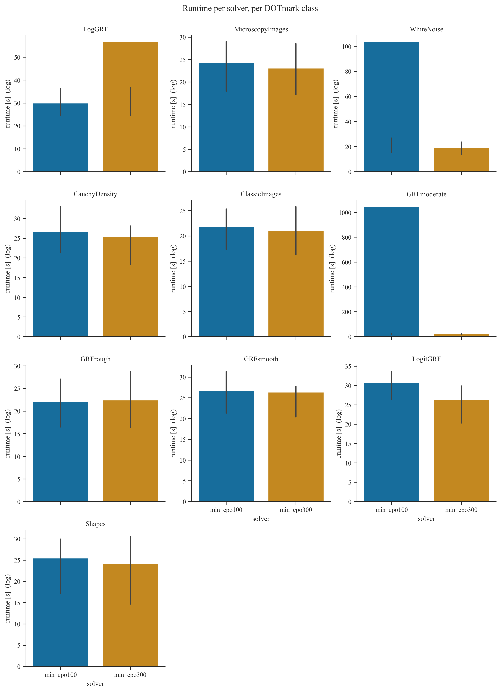
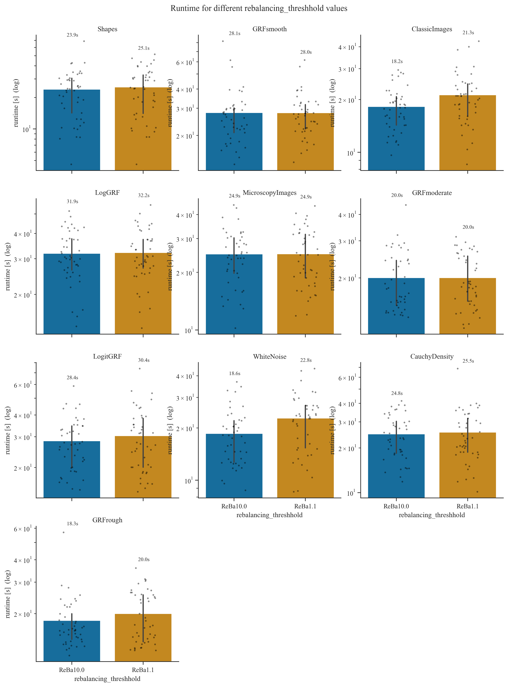
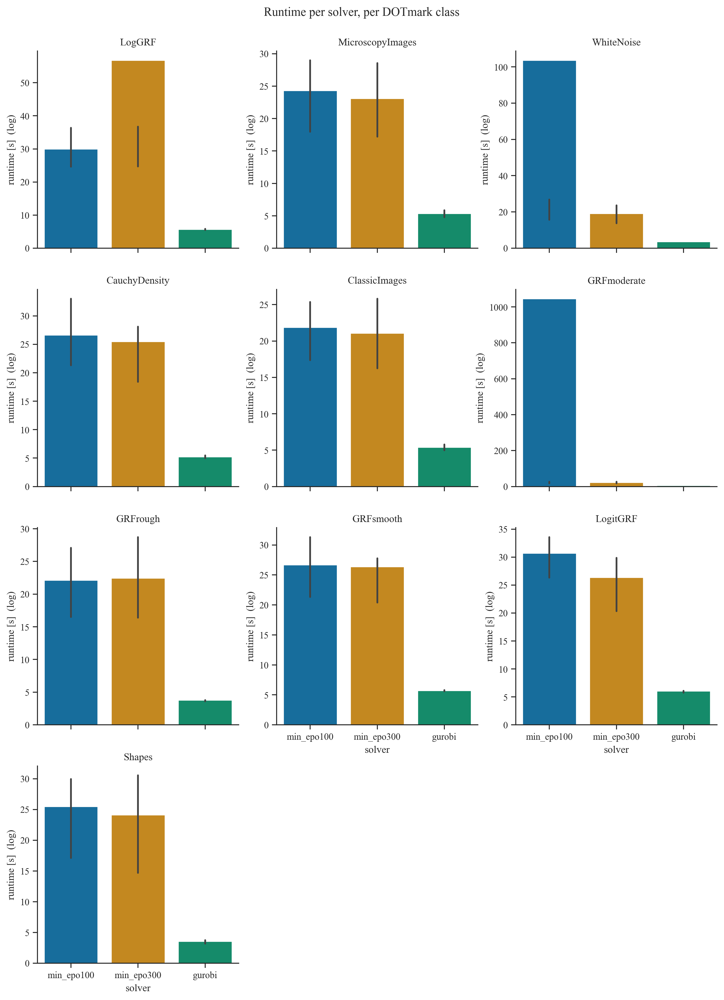

# Overview
This project implements a first Order solver for Optimal Transport problems, the restarted Primal-Dual Hybrid Gradient (rPDHG) algorithm. 
It combines different restart heuristics with specialized Pock-Chambolle preconditioning, wich are compared on the DOTMARK-Benchmark Problems.

# Mathematical Background

## The Problem: Discrete Optimal Transport

We consider the discrete Optimal Transport problem in its classic Kantorovich formulation:

$$\min_{x \in \mathbb{R}^{N^2}} c^\top x \quad \text{s.t.} \quad Ax = b, \; x \ge 0$$

where a first $N$-dimensional measure $a \in \mathbb{R}^N$ is transported to a second measure $b \in \mathbb{R}^N$. Here, $N = H \cdot W$ represents the number of pixels in an $H \times W$ image, and we consider the full dense transport problem (all pixels from image A to all pixels from image B).

The matrix $A \in \mathbb{R}^{2N \times N^2}$ encodes the mass-balance constraints. We linearize the transport variables $x_{ij}$ into a vector $x \in \mathbb{R}^{N^2}$ with the index $k = i \cdot N + j$. Every column of $A$ has exactly two non-zero entries (both with value 1), corresponding to the supply and demand equations.

## Spectral Norm
For the spectral norm $\|A\|_2$, it suffices to compute the eigenvalues of $AA^\top \in \mathbb{R}^{2N \times 2N}$, since $\|A\|_2^2 = \lambda_{\max}(AA^\top)$. 

Based on the structure of the transport constraints, $AA^\top$ forms a block matrix:

$$AA^\top = \begin{pmatrix} B_{11} & B_{12} \\ B_{21} & B_{22} \end{pmatrix} = \begin{pmatrix} N I_N & J_N \\ J_N & N I_N \end{pmatrix}$$

where $I_N$ is the identity matrix and $J_N$ is the matrix of all ones. Analyzing the eigenvectors of this specific block structure reveals that the maximum eigenvalue is exactly $2N$. Therefore, the spectral norm of the constraint matrix $A$ for a fully connected discrete OT problem on a grid is exactly:

$$\|A\|_2 = \sqrt{2N}$$

This exact closed-form solution replaces expensive spectral norm approximations (e.g., via Power Iteration) and strictly fulfills the theoretical requirements for the PDHG step-size selection.

## The PDHG Algorithm

The (restarted) PDHG Algorithm relies on the primal-dual framework, utilizing the following concepts:

* **Lagrangian:** The Lagrangian $\mathcal{L}(x, y)$ couples the primal objective with the equality constraints via the dual variables $y \in \mathbb{R}^{2N}$:
    $$\mathcal{L}(x, y) = c^\top x + \langle y, b - Ax \rangle$$
    In this implementation, the indicator function $\iota_{\mathbb{R}^N_{\ge 0}}(x)$ implicitly handles the non-negativity constraint $x \ge 0$.

* **Projection:** To maintain feasibility during the iteration, we apply projection operators onto the non-negative orthant. The projection $P_{\ge 0}(x)$ is computed component-wise as:
    $$P_{\ge 0}(x_k) = \max(0, x_k)$$

* **Duality Gap:** The Duality Gap (or Lagrange Gap) serves as our primary metric for convergence monitoring and restart triggering. It quantifies the difference between the primal objective $f(x) = c^\top x$ and the dual objective $g(y) = \inf_x \mathcal{L}(x, y)$. At optimality, this gap closes to zero:
    $$\text{Gap}(x, y) = c^\top x - \inf_{x'} \mathcal{L}(x', y)$$
    Monitoring this gap allows us to detect stagnation and trigger adaptive restarts to accelerate convergence.

## Restart Techniques

The standard PDHG algorithm can exhibit oscillatory behavior, particularly when the problem is not strongly convex. To accelerate convergence and prevent stagnation, we implement two distinct restart strategies that reset the primal and dual variables (or their momentum terms) based on specific triggers.

### Fixed Restarts
Fixed restarts follow a rigid schedule, resetting the algorithm strictly every $K$ iterations, where $K$ is a predefined parameter:
$$k \equiv 0 \pmod K \implies \text{Restart}$$
This approach is computationally inexpensive and easy to implement. However, the optimal frequency $K$ is problem-dependent; choosing an overly small $K$ leads to unnecessary overhead, while an overly large $K$ may fail to prevent long-lasting oscillations.

### Adaptive Restarts (KKT Error & Progress-based)

Instead of a simple gap-monitoring approach, our implementation utilizes a state-of-the-art adaptive restart strategy inspired by **Applegate et al. (2021)**. The strategy relies on a normalized progress metric $\mu$ that combines the duality gap with primal and dual infeasibilities, normalized by the distance traveled since the last restart.

#### 1. The Progress Metric $\mu$
For every diagnostic step, we evaluate the quality of the current iterate $z = (x, y)$ and the ergodic average $\bar{z} = (\bar{x}, \bar{y})$ using the metric:
$$\mu(z, z_{ref}) = \frac{\text{Gap}(z)}{dist(z, z_{ref})} + \|r_p\|_2 + \|r_d\|_2$$
where $z_{ref}$ is the starting point of the current epoch (the point of the last restart). 

The distance $dist(z, z_{ref})$ is measured in a weighted Euclidean norm to account for the scaling difference between primal and dual variables:
$$dist(z, z_{ref}) = \sqrt{\omega \|x - x_{ref}\|^2_2 + \frac{1}{\omega} \|y - y_{ref}\|^2_2}$$
with the weight $\omega = \sqrt{\tau / \sigma}$ derived from the current step sizes.

#### 2. Restart Logic
At each diagnostic interval, the solver compares the current iterate and the average iterate:
1. **Selection:** We select the "best" point $z^*$ (either $z_{curr}$ or $z_{avg}$) that minimizes $\mu$, and set $\mu_{best}$ to its metric value.
2. **Trigger:** Provided the current epoch has run for at least `min_epoch_length` iterations, a restart is triggered in either of two cases:
   - **Sufficient improvement** — the best metric in the epoch has dropped well below the value at the last restart,
     $$\mu_{best} \le 0.9 \cdot \mu_{prev\_restart};$$
   - **Stalling after improvement** — the metric has already improved substantially but then began to increase again,
     $$0.1 \cdot \mu_{prev\_restart} \ge \mu_{best} > \mu_{last\_check}.$$

   Independently of these, a hard cap forces a restart once the epoch reaches `fixed_iter_restart` iterations, which bounds the worst-case epoch length even if neither metric condition fires. The full inequalities and the role of `min_epoch_length` / `fixed_iter_restart` are restated in the implementation section ("Adaptive Restart Metric").

#### 3. Why this works
By normalizing the KKT residuals by the distance $dist(z, z_{ref})$, we obtain a scale-invariant measure of "progress per unit of movement." This allows the solver to detect when the algorithm is merely oscillating around an optimum without making meaningful progress, triggering a momentum reset to refocus the search direction.
## Diagonal Preconditioning 

## Duality Gap 

  

# Algorithm Implementation Details

This section describes how the rPDHG solver is implemented in the two core files
`algorithms/pdhg_restarted_cu.py` (main outer loop, restart logic, diagnostics) and
`algorithms/onestep.py` (a single GPU PDHG step exploiting the OT constraint structure).
All array operations run on the GPU through CuPy; the host only sees the final result.

## The Inner Step (`onestep.py`)

The function `one_pdhg_step_gpu_inplace(x, y, b, c, tau, sigma, N, x_plus, y_plus, grad_buffer, x_tilde_buf)`
realizes one full primal-dual hybrid gradient iteration

$$
\begin{aligned}
x_{k+1} &= P_{\ge 0}\!\big(x_k - \tau (c - A^\top y_k)\big),\\
y_{k+1} &= y_k + \sigma \big(b - A(2x_{k+1} - x_k)\big),
\end{aligned}
$$

without ever instantiating the sparse matrix $A$. The transport matrix has a fixed structure:
column $k = i\cdot N + j$ has a one in row $i$ (supply node $i$) and in row $N + j$ (demand node $j$).
This is exploited as follows:

- **Apply $A^\top$ to $y$**: For OT, $(A^\top y)_{ij} = y_i + y_{N+j}$. The code constructs this
  $N\times N$ matrix by broadcasting `y[:N, None] + y[None, N:]` directly into the preallocated
  buffer `x_tilde_buf`.
- **Primal step**: The gradient $c - A^\top y$ is written into the same buffer, scaled by
  $\tau$, and subtracted from `x.reshape(N,N)`, with the result going straight into `x_plus`.
  The projection $P_{\ge 0}$ is realized by `x_plus.clip(0, None, out=x_plus)`.
- **Apply $A$ to a vector** ($\tilde x = 2x_{k+1} - x_k$): For OT, $(A\tilde x)_i$ for
  $i < N$ is the row sum of $\tilde x$ viewed as $N\times N$, and for $i \ge N$ it is the
  column sum. The code computes both with two `sum(axis=...)` calls.
- **Dual step**: `y_plus[:N]` and `y_plus[N:]` are updated with the residuals
  `b[:N] - row_sums` and `b[N:] - col_sums`, weighted by $\sigma$.

Every elementwise operation uses an `out=` parameter; no temporary arrays are allocated
inside the step. The two scratch buffers `grad_buffer` (size $n = N^2$) and `x_tilde_buf`
(shape $N\times N$) are allocated once in the outer loop and reused for every iteration.

## The Outer Loop (`pdhg_restarted_cu.py`)

### Initialization

1. The constraint matrix size gives $m = 2N$ rows and $n = N^2$ columns.
2. Step sizes $\tau$, $\sigma$ are obtained from `compute_ot_preconditioner_cu` (see below)
   unless the user supplies them.
3. Two pairs of buffers are allocated for the primal and dual variables (`x_0/x_1`,
   `y_0/y_1`). The references `x_curr, x_next` (and analogously for $y$) are rotated
   between them after every step; no data is copied to advance the iteration.
4. `x_avg`, `y_avg` hold the ergodic average over the current epoch, maintained by an
   in-place Welford update (reset on each restart). `x_ref`, `y_ref` record the starting point of the current epoch
   (used in the adaptive restart criterion).

### Per-Iteration Sequence

Each iteration of the main `for k in range(max_iter)` loop performs:

1. **Step-size growth (clean accepts only)**: When the line-search below accepts the
   step on its *first* attempt, the step sizes are inflated for the next iteration,
   $\tau \leftarrow \theta\tau$, $\sigma \leftarrow \theta\sigma$. With `theta` slightly
   above 1 (default 1.05) they drift upward until the line search starts rejecting them.
   No growth is applied on any iteration whose step needed shrinking.
2. **Line-search loop (up to 10 attempts)**: Call `one_pdhg_step_gpu_inplace` with the
   current $\tau$, $\sigma$ and check the Malitsky–Pock-style acceptance test

   $$2\,|\langle \Delta y, A\,\Delta x\rangle| \le 0.95\Big(\tfrac{1}{\tau}\|\Delta x\|^2 + \tfrac{1}{\sigma}\|\Delta y\|^2\Big),$$

   where $\Delta x = x_{k+1} - x_k$, $\Delta y = y_{k+1} - y_k$, and $A\,\Delta x$ is
   again evaluated as row/column sums of `Δx.reshape(N, N)`. If the test fails,
   $\tau$ and $\sigma$ are shrunk by `step_shrinkage` (default 0.75) — but never below a
   floor of $10^{-6}\times$ their value at loop entry — and the step is recomputed. If 10
   attempts fail (or the floor is reached), the preconditioner is recomputed and one safe
   step is taken.
3. **Welford update of the ergodic average** (in place, no temporaries), using the
   epoch-local counter `epoch_k`, which is reset to 0 on every restart so the average is
   taken over the current epoch rather than the whole run:
   `x_avg *= (1 - 1/epoch_k); x_avg += x_next / epoch_k`.
4. **Pointer swap**: `x_curr, x_next = x_next, x_curr` (and likewise for $y$).
   This is an O(1) reference exchange — the new "current" iterate becomes the
   freshly computed one, and the now-stale buffer is reused for the next write.
5. **Cheap restart check**: For `restart_check == "fixed"` a restart is triggered when
   $k \bmod K = 0$. For `"adaptive"` the decision is deferred to the diagnostic block.
6. **Diagnostic block (every `diagnostik_i` iterations)**: This is the only place
   where the full KKT residuals are evaluated, because each evaluation requires two
   full $A\tilde x$ / $A^\top y$ products and several reductions. For both
   $z_{curr}$ and the ergodic average $z_{avg}$ the block computes
   - primal objective $c^\top x$ and dual objective $b^\top y$, hence the absolute gap,
   - primal residual $\|Ax - b\|_2$ via row/column sums,
   - dual residual $\|(A^\top y - c)_+\|_2$ via the broadcast trick from step 1.

   Relative versions are formed — gap `/(1 + |c^\top x| + |b^\top y|)`, primal
   `/(1 + \|b\|)`, dual `/(1 + \|c\|)` — and compared to the user tolerances. If all
   three are below tolerance the loop exits. The block also drives the adaptive restart
   decision and an optional step-size rebalancing (`rebalance_tau_sigma`). Rebalancing is
   considered only once at least one of the relative residuals has dropped below its
   tolerance, and then fires when the primal/dual residual ratio falls outside `[1/T, T]`
   with $T = $ `rebalancing_threshhold`; the applied factor $\sqrt{\text{ratio}}$ is
   clamped to $[0.8, 1.25]$ per step.
7. **Restart**: If `do_restart` is `True`, both `x_curr, y_curr` are replaced by the
   restart candidate $z^* \in \{z_{curr}, z_{avg}\}$ chosen by the adaptive rule
   below, the epoch counter and reference point are reset, and the next iteration
   continues from there.

### Adaptive Restart Metric

Inside the diagnostic block, the adaptive branch evaluates the normalized progress
metric of Applegate et al. (2021) with $\omega = \sqrt{\tau/\sigma}$:

$$\mu(z) = \frac{\text{Gap}(z)}{\max(\text{dist}(z, z_{ref}),\,10^{-15})} + \|r_p(z)\|_2 + \|r_d(z)\|_2,$$

$$\text{dist}(z, z_{ref}) = \sqrt{\omega\,\|x - x_{ref}\|^2 + \tfrac{1}{\omega}\,\|y - y_{ref}\|^2}.$$

$\mu$ is computed for the current iterate and the ergodic average, and the smaller
of the two is taken as $\mu_{best}$ together with its associated point $z^* =
(x_{restart}, y_{restart})$. A restart is triggered when (and only after the
current epoch has reached `min_epoch_length` iterations):

- $\mu_{best} \le 0.9 \cdot \mu_{prev\_restart}$  — sufficient improvement compared
  to the start of the epoch, **or**
- $0.1\,\mu_{prev\_restart} \ge \mu_{best} > \mu_{last\_check}$  — the metric began
  to deteriorate after a strong initial improvement, **or**
- the epoch has reached `fixed_iter_restart` iterations (hard cap).

If no restart fires, `mu_last_check` is updated so that the next diagnostic step
can detect deterioration.

### Preconditioner (`compute_ot_preconditioner_cu`)

The Pock–Chambolle preconditioner exploits the OT column/row structure
(every column has 2 nonzeros, every row has $N$ nonzeros):

$$\tau_{base} = 2^{-\alpha}, \qquad \sigma_{base} = N^{-(2-\alpha)}.$$

To balance primal and dual scales, the data ratio $\omega = \|c\|_2 / \|b\|_2$
is folded in symmetrically:

$$\tau = \tau_{base}\sqrt{\omega}\cdot s, \qquad \sigma = \frac{\sigma_{base}}{\sqrt{\omega}}\cdot s,$$

where $s = $ `safety_margin` (default 0.999) keeps $\tau\sigma\|A\|_2^2 < 1$
strictly, the sufficient condition for convergence of vanilla PDHG. The data-ratio
factor $\sqrt{\omega}$ cancels in the product, so $\tau\sigma$ — and hence the slack to
the convergence boundary — is independent of $\omega$. With $\|A\|_2^2 = 2N$ (see the
spectral-norm derivation above),

$$\tau\sigma\,\|A\|_2^2 = 2^{\,1-\alpha}\,N^{\,\alpha-1}\,s^2 = \left(\tfrac{2}{N}\right)^{1-\alpha} s^2,$$

which equals exactly $s^2$ at the default $\alpha = 1$. For $\alpha \neq 1$ the exponent
shifts the product (so $\alpha$ trades the primal step size against the dual one);
convergence stays guaranteed as long as this product remains below 1.

### Memory and Allocation Discipline

The hot loop performs **zero heap allocations**:
- all per-step arithmetic in `onestep.py` uses `out=` parameters and in-place operators;
- the ergodic average and the line-search differences are written into pre-allocated
  buffers (`grad_buffer`, `x_tilde_buf`);
- iterate advancement is a Python reference swap, never a copy;
- only the restart action and the (infrequent) diagnostic block allocate small
  temporaries — and the diagnostic block runs only every `diagnostik_i` iterations.

This is what allows the GPU kernels to dominate the runtime profile and the solver
to scale to the $1024 \times 1024$ transport problems of the DOTmark benchmark.

# Results

> **Hardware.** All results below were produced on a machine with an AMD Ryzen
> 6-core CPU (3.59 GHz), 16 GB RAM, and an NVIDIA GeForce GTX 1050 Ti GPU
> (4 GB VRAM, driver 560.94) running Windows 10. Software: Python 3.14, NumPy
> 2.4, SciPy 1.16, and Gurobi 13.0.

We also varied the `min_epoch_length` parameter, which sets the minimum number of
iterations an epoch must run before an adaptive restart may be triggered.

  

Across the tested values the runtimes are essentially indistinguishable, so the
choice of `min_epoch_length` does not appear to make much of a difference for the
overall solver performance.

We also compared different values of the step-size rebalancing threshold
`rebalancing_threshhold`, which controls when the primal/dual step sizes are
rebalanced.

  

As with `min_epoch_length`, the exact rebalancing threshold does not seem to
matter much — the runtimes are very similar across the tested values.

We also compared the runtime of our rPDHG solver against Gurobi. Gurobi
significantly outperformed rPDHG on the tested problems.

  

