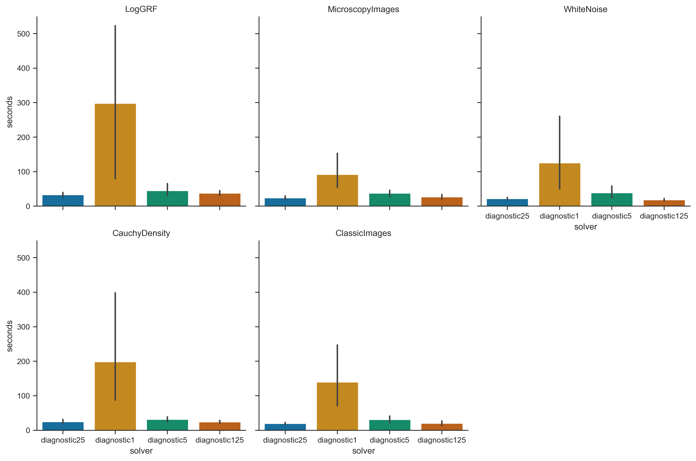

# Overview
This project implements a first Order solver for Optimal Transport problems, the restarted Primal-Dual Hybrid Gradient (rPDHG) algorithm. 
It combines different restart heuristics with specialized Pock-Chambolle preconditioning, wich are compared on the DOTMARK-Benchmark Problems.

# Mathematical Background

## The Problem: Discrete Optimal Transport

We consider the discrete Optimal Transport problem in its classic Kantorovich formulation:

$$\min_{x \in \mathbb{R}^{N^2}} c^\top x \quad \text{s.t.} \quad Ax = b, \; x \ge 0$$

where a first $N$-dimensional measure $a \in \mathbb{R}^N$ is transported to a second measure $b \in \mathbb{R}^N$. Here, $N = H \cdot W$ represents the number of pixels in an $H \times W$ image, and we consider the full dense transport problem (all pixels from image A to all pixels from image B).

The matrix $A \in \mathbb{R}^{2N \times N^2}$ encodes the mass-balance constraints. We linearize the transport variables $x_{ij}$ into a vector $x \in \mathbb{R}^{N^2}$ with the index $k = i \cdot N + j$. Every column of $A$ has exactly two non-zero entries (both with value 1), corresponding to the supply and demand equations.

## Spectral Norm
For the spectral norm $\|A\|_2$, it suffices to compute the eigenvalues of $AA^\top \in \mathbb{R}^{2N \times 2N}$, since $\|A\|_2^2 = \lambda_{\max}(AA^\top)$. 

Based on the structure of the transport constraints, $AA^\top$ forms a block matrix:

$$AA^\top = \begin{pmatrix} B_{11} & B_{12} \\ B_{21} & B_{22} \end{pmatrix} = \begin{pmatrix} N I_N & J_N \\ J_N & N I_N \end{pmatrix}$$

where $I_N$ is the identity matrix and $J_N$ is the matrix of all ones. Analyzing the eigenvectors of this specific block structure reveals that the maximum eigenvalue is exactly $2N$. Therefore, the spectral norm of the constraint matrix $A$ for a fully connected discrete OT problem on a grid is exactly:

$$\|A\|_2 = \sqrt{2N}$$

This exact closed-form solution replaces expensive spectral norm approximations (e.g., via Power Iteration) and strictly fulfills the theoretical requirements for the PDHG step-size selection.

## The PDHG Algorithm

The (restarted) PDHG Algorithm relies on the primal-dual framework, utilizing the following concepts:

* **Lagrangian:** The Lagrangian $\mathcal{L}(x, y)$ couples the primal objective with the equality constraints via the dual variables $y \in \mathbb{R}^{2N}$:
    $$\mathcal{L}(x, y) = c^\top x + \langle y, b - Ax \rangle$$
    In this implementation, the indicator function $\iota_{\mathbb{R}^N_{\ge 0}}(x)$ implicitly handles the non-negativity constraint $x \ge 0$.

* **Projection:** To maintain feasibility during the iteration, we apply projection operators onto the non-negative orthant. The projection $P_{\ge 0}(x)$ is computed component-wise as:
    $$P_{\ge 0}(x_k) = \max(0, x_k)$$

* **Duality Gap:** The Duality Gap (or Lagrange Gap) serves as our primary metric for convergence monitoring and restart triggering. It quantifies the difference between the primal objective $f(x) = c^\top x$ and the dual objective $g(y) = \inf_x \mathcal{L}(x, y)$. At optimality, this gap closes to zero:
    $$\text{Gap}(x, y) = c^\top x - \inf_{x'} \mathcal{L}(x', y)$$
    Monitoring this gap allows us to detect stagnation and trigger adaptive restarts to accelerate convergence.

## Restart Techniques

The standard PDHG algorithm can exhibit oscillatory behavior, particularly when the problem is not strongly convex. To accelerate convergence and prevent stagnation, we implement two distinct restart strategies that reset the primal and dual variables (or their momentum terms) based on specific triggers.

### Fixed Restarts
Fixed restarts follow a rigid schedule, resetting the algorithm strictly every $K$ iterations, where $K$ is a predefined parameter:
$$k \equiv 0 \pmod K \implies \text{Restart}$$
This approach is computationally inexpensive and easy to implement. However, the optimal frequency $K$ is problem-dependent; choosing an overly small $K$ leads to unnecessary overhead, while an overly large $K$ may fail to prevent long-lasting oscillations.

### Adaptive Restarts (KKT Error & Progress-based)

Instead of a simple gap-monitoring approach, our implementation utilizes a state-of-the-art adaptive restart strategy inspired by **Applegate et al. (2021)**. The strategy relies on a normalized progress metric $\mu$ that combines the duality gap with primal and dual infeasibilities, normalized by the distance traveled since the last restart.

#### 1. The Progress Metric $\mu$
For every diagnostic step, we evaluate the quality of the current iterate $z = (x, y)$ and the ergodic average $\bar{z} = (\bar{x}, \bar{y})$ using the metric:
$$\mu(z, z_{ref}) = \frac{\text{Gap}(z)}{dist(z, z_{ref})} + \|r_p\|_2 + \|r_d\|_2$$
where $z_{ref}$ is the starting point of the current epoch (the point of the last restart). 

The distance $dist(z, z_{ref})$ is measured in a weighted Euclidean norm to account for the scaling difference between primal and dual variables:
t(z, z_{ref}) = \sqrt{\omega \|x - x_{ref}\|^2_2 + \frac{1}{\omega} \|y - y_{ref}\|^2_2}$$
with t$$dishe weight $\omega = \sqrt{\tau / \sigma}$ derived from the current step sizes.

#### 2. Restart Logic
At each diagnostic interval, the solver compares the current iterate and the average iterate:
1. **Selection:** We select the "best" point $z^*$ (either $z_{curr}$ or $z_{avg}$) that minimizes $\mu$.
2. **Trigger:** A restart is triggered if the best $\mu$ found in the current epoch significantly improves upon the quality at the previous restart, specifically:
   $$\mu_{best} \le 0.9 \cdot \mu_{prev\_restart}$$
   or if convergence stalls and the metric begins to increase ($\mu_{best} > \mu_{last\_check}$).

#### 3. Why this works
By normalizing the KKT residuals by the distance $dist(z, z_{ref})$, we obtain a scale-invariant measure of "progress per unit of movement." This allows the solver to detect when the algorithm is merely oscillating around an optimum without making meaningful progress, triggering a momentum reset to refocus the search direction.
## Diagonal Preconditioning 

# Results(inkl diagrams)

To find a good tradeoff between reducing diagnostic overhead and ... different intervals were tested (for adaptive restarts)

  

/*TODO: , Vergleich Laufzeit Gurobi/RPDHG*/

## Duality Gap 

  

