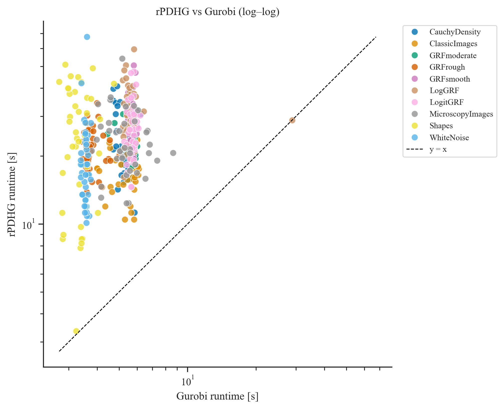
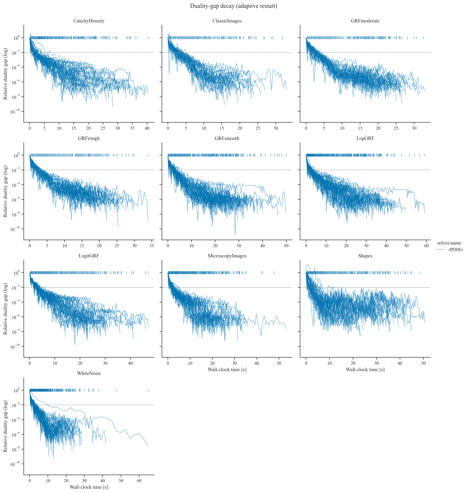
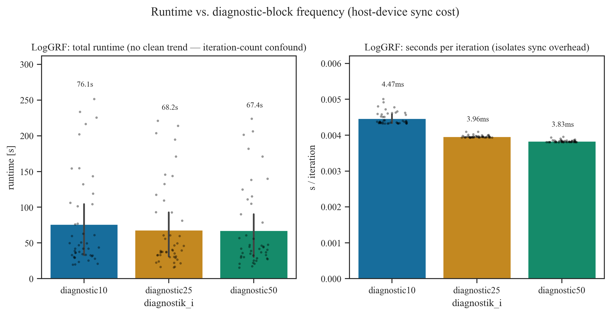
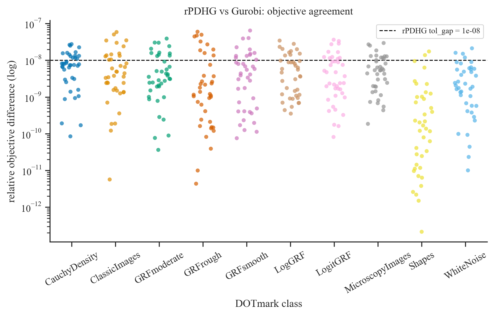
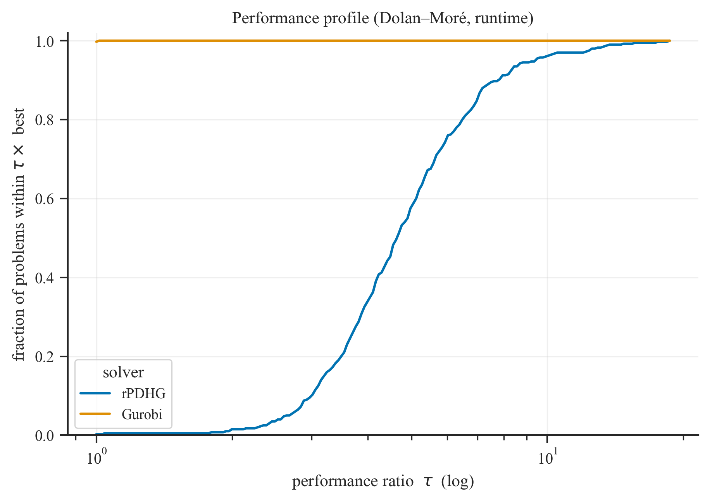
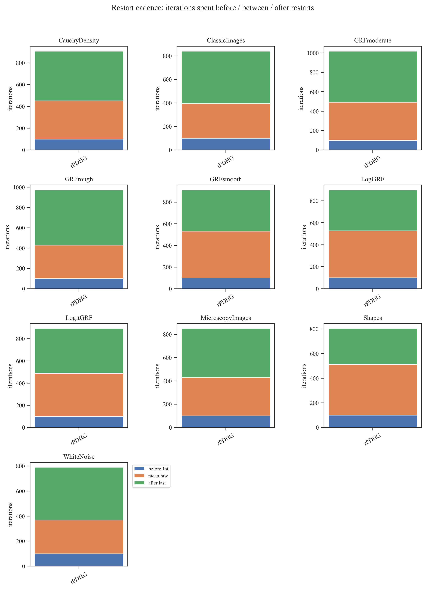
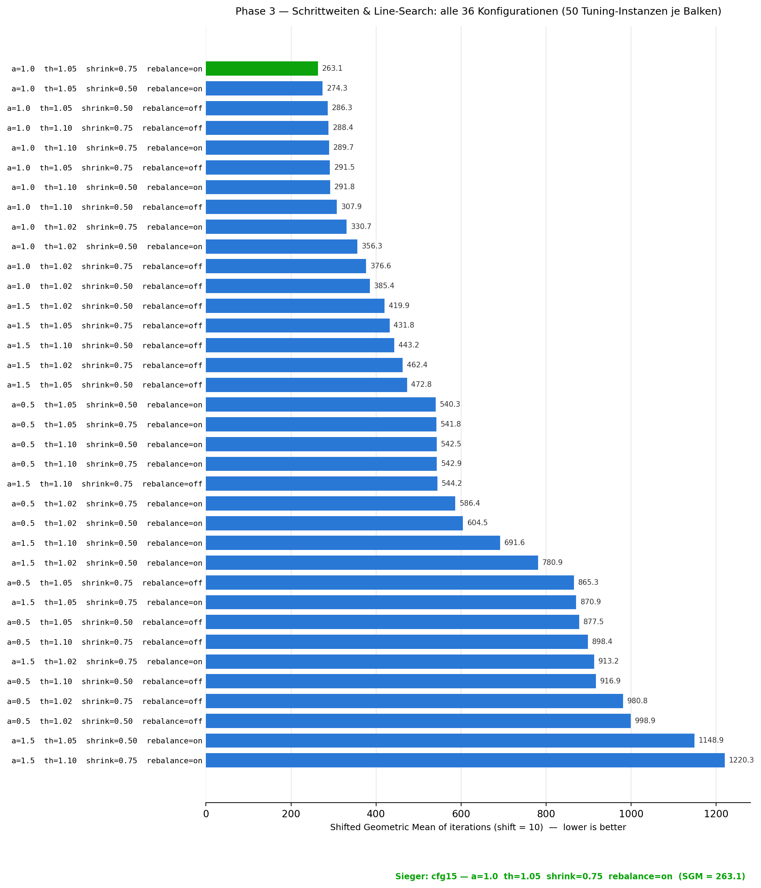

# rPDHG — GPU-Accelerated Optimal Transport Solver

A from-scratch GPU solver for discrete Optimal Transport (Kantorovich LP),
benchmarked against the commercial solver Gurobi on 400 real-world problem
instances.

## Key Results

- **Matches Gurobi's solution quality**: median relative objective
  difference of $3.1\times10^{-9}$ across 400 benchmark instances — the two
  solvers agree to 9 significant digits.
- **Fully GPU-resident**: the entire solve — including a closed-form
  spectral-norm derivation that replaces iterative approximation — runs on
  the GPU via CuPy, without ever materializing the constraint matrix.
- **Rigorously benchmarked**: 400 DOTmark instances across all 10 problem
  categories, a systematic 3-phase hyperparameter search, and a dedicated
  investigation into the GPU synchronization bottleneck limiting current
  performance.
- **Own implementation of a 2021 research algorithm** (adaptive restarts
  from Applegate et al., NeurIPS 2021 — the method behind Google's PDLP
  solver), specialized to the Optimal Transport constraint structure.

  

<em>Runtime per problem instance, rPDHG vs. Gurobi (log-log, n=400).
rPDHG currently trails Gurobi at this (comparatively small) problem size — see the
sync-bottleneck write-up below for why, and where the gap is expected to close.</em>

## Tech Stack

Python · CuPy (CUDA) · NumPy/SciPy · Gurobi · pytest · Jupyter

## What's Interesting About This, in Plain Terms

Optimal Transport asks: what's the cheapest way to move one distribution of
mass into another — e.g., turning one image's pixel intensities into
another's? Written out exactly, this becomes a linear program with as many
variables as there are pixel-pairs: for two $32\times32$ images that's
already ~1 million variables, growing quadratically with resolution.
Generic LP solvers choke on this quickly.

This project builds a specialized first-order solver (PDHG, primal-dual
hybrid gradient) that exploits the specific structure of the transport
problem to run entirely on the GPU: no sparse matrix is ever built, every
step is a handful of GPU array operations, and the algorithm's own
convergence parameters are computed in closed form instead of estimated. It
also implements an adaptive restart strategy from a 2021 NeurIPS paper (the
algorithmic core behind Google's production LP solver PDLP) to keep the
underlying method from oscillating.

The project includes a full experimental pipeline — hyperparameter tuning, a
400-instance benchmark against Gurobi, correctness verification, and a
GPU-profiling investigation into a synchronization bottleneck — written up
in an accompanying [scientific report](Abschlussbericht.pdf).

For the full mathematical derivation, implementation details, and complete
experimental results, see below.

---

# Mathematical Background

## The Problem: Discrete Optimal Transport

We consider the discrete Optimal Transport problem in its classic Kantorovich formulation:

$$\min_{x \in \mathbb{R}^{N^2}} c^\top x \quad \text{s.t.} \quad Ax = b, \; x \ge 0$$

where a first $N$-dimensional measure $a \in \mathbb{R}^N$ is transported to a second measure $b \in \mathbb{R}^N$. Here, $N = H \cdot W$ represents the number of pixels in an $H \times W$ image, and we consider the full dense transport problem (all pixels from image A to all pixels from image B).

The matrix $A \in \mathbb{R}^{2N \times N^2}$ encodes the mass-balance constraints. We linearize the transport variables $x_{ij}$ into a vector $x \in \mathbb{R}^{N^2}$ with the index $k = i \cdot N + j$. Every column of $A$ has exactly two non-zero entries (both with value 1), corresponding to the supply and demand equations.

## Spectral Norm
For the spectral norm $\|A\|_2$, it suffices to compute the eigenvalues of $AA^\top \in \mathbb{R}^{2N \times 2N}$, since $\|A\|_2^2 = \lambda_{\max}(AA^\top)$. 

Based on the structure of the transport constraints, $AA^\top$ forms a block matrix:

$$AA^\top = \begin{pmatrix} B_{11} & B_{12} \\ B_{21} & B_{22} \end{pmatrix} = \begin{pmatrix} N I_N & J_N \\ J_N & N I_N \end{pmatrix}$$

where $I_N$ is the identity matrix and $J_N$ is the matrix of all ones. Analyzing the eigenvectors of this specific block structure reveals that the maximum eigenvalue is exactly $2N$. Therefore, the spectral norm of the constraint matrix $A$ for a fully connected discrete OT problem on a grid is exactly:

$$\|A\|_2 = \sqrt{2N}$$

This exact closed-form solution replaces expensive spectral norm approximations (e.g., via Power Iteration) and strictly fulfills the theoretical requirements for the PDHG step-size selection.

## The PDHG Algorithm

The (restarted) PDHG Algorithm relies on the primal-dual framework, utilizing the following concepts:

* **Lagrangian:** The Lagrangian $\mathcal{L}(x, y)$ couples the primal objective with the equality constraints via the dual variables $y \in \mathbb{R}^{2N}$:
    $$\mathcal{L}(x, y) = c^\top x + \langle y, b - Ax \rangle$$
    In this implementation, the indicator function $\iota_{\mathbb{R}^N_{\ge 0}}(x)$ implicitly handles the non-negativity constraint $x \ge 0$.

* **Projection:** To maintain feasibility during the iteration, we apply projection operators onto the non-negative orthant. The projection $P_{\ge 0}(x)$ is computed component-wise as:
    $$P_{\ge 0}(x_k) = \max(0, x_k)$$

* **Duality Gap:** The Duality Gap (or Lagrange Gap) serves as our primary metric for convergence monitoring and restart triggering. It quantifies the difference between the primal objective $f(x) = c^\top x$ and the dual objective $g(y) = \inf_x \mathcal{L}(x, y)$. At optimality, this gap closes to zero:
    $$\text{Gap}(x, y) = c^\top x - \inf_{x'} \mathcal{L}(x', y)$$
    Monitoring this gap allows us to detect stagnation and trigger adaptive restarts to accelerate convergence.

## Restart Techniques

The standard PDHG algorithm can exhibit oscillatory behavior, particularly when the problem is not strongly convex. To accelerate convergence and prevent stagnation, we implement two distinct restart strategies that reset the primal and dual variables (or their momentum terms) based on specific triggers.

### Fixed Restarts
Fixed restarts follow a rigid schedule, resetting the algorithm strictly every $K$ iterations, where $K$ is a predefined parameter:
$$k \equiv 0 \pmod K \implies \text{Restart}$$
This approach is computationally inexpensive and easy to implement. However, the optimal frequency $K$ is problem-dependent; choosing an overly small $K$ leads to unnecessary overhead, while an overly large $K$ may fail to prevent long-lasting oscillations.

### Adaptive Restarts (KKT Error & Progress-based)

Instead of a simple gap-monitoring approach, our implementation utilizes a state-of-the-art adaptive restart strategy inspired by **Applegate et al. (2021)**. The strategy relies on a normalized progress metric $\mu$ that combines the duality gap with primal and dual infeasibilities, normalized by the distance traveled since the last restart.

#### 1. The Progress Metric $\mu$
For every diagnostic step, we evaluate the quality of the current iterate $z = (x, y)$ and the ergodic average $\bar{z} = (\bar{x}, \bar{y})$ using the metric:
$$\mu(z, z_{ref}) = \frac{\text{Gap}(z)}{dist(z, z_{ref})} + \|r_p\|_2 + \|r_d\|_2$$
where $z_{ref}$ is the starting point of the current epoch (the point of the last restart). 

The distance $dist(z, z_{ref})$ is measured in a weighted Euclidean norm to account for the scaling difference between primal and dual variables:
$$dist(z, z_{ref}) = \sqrt{\omega \|x - x_{ref}\|^2_2 + \frac{1}{\omega} \|y - y_{ref}\|^2_2}$$
with the weight $\omega = \sqrt{\tau / \sigma}$ derived from the current step sizes.

#### 2. Restart Logic
At each diagnostic interval, the solver compares the current iterate and the average iterate:
1. **Selection:** We select the "best" point $z^*$ (either $z_{curr}$ or $z_{avg}$) that minimizes $\mu$, and set $\mu_{best}$ to its metric value.
2. **Trigger:** Provided the current epoch has run for at least `min_epoch_length` iterations, a restart is triggered in either of two cases:
   - **Sufficient improvement** — the best metric in the epoch has dropped well below the value at the last restart,
     $$\mu_{best} \le 0.9 \cdot \mu_{prev\_restart};$$
   - **Stalling after improvement** — the metric has already improved substantially but then began to increase again,
     $$0.1 \cdot \mu_{prev\_restart} \ge \mu_{best} > \mu_{last\_check}.$$

   Independently of these, a hard cap forces a restart once the epoch reaches `fixed_iter_restart` iterations, which bounds the worst-case epoch length even if neither metric condition fires. The full inequalities and the role of `min_epoch_length` / `fixed_iter_restart` are restated in the implementation section ("Adaptive Restart Metric").

#### 3. Why this works
By normalizing the KKT residuals by the distance $dist(z, z_{ref})$, we obtain a scale-invariant measure of "progress per unit of movement." This allows the solver to detect when the algorithm is merely oscillating around an optimum without making meaningful progress, triggering a momentum reset to refocus the search direction.
## Duality Gap 

  

Relative duality gap over wall-clock time, one panel per DOTmark class (all
400 instances of the $32\times32$ benchmark described below, one curve per
instance). Vertical ticks at the top mark restart events; the dashed line
marks the relative tolerance $10^{-2}$.

# Algorithm Implementation Details

This section describes how the rPDHG solver is implemented in the two core files
`algorithms/pdhg_restarted_cu.py` (main outer loop, restart logic, diagnostics) and
`algorithms/onestep.py` (a single GPU PDHG step exploiting the OT constraint structure).
All array operations run on the GPU through CuPy; the host only sees the final result.

## The Inner Step (`onestep.py`)

The function `one_pdhg_step_gpu_inplace(x, y, b, c, tau, sigma, N, x_plus, y_plus, grad_buffer, x_tilde_buf)`
realizes one full primal-dual hybrid gradient iteration

$$
\begin{aligned}
x_{k+1} &= P_{\ge 0}\!\big(x_k - \tau (c - A^\top y_k)\big),\\
y_{k+1} &= y_k + \sigma \big(b - A(2x_{k+1} - x_k)\big),
\end{aligned}
$$

without ever instantiating the sparse matrix $A$. The transport matrix has a fixed structure:
column $k = i\cdot N + j$ has a one in row $i$ (supply node $i$) and in row $N + j$ (demand node $j$).
This is exploited as follows:

- **Apply $A^\top$ to $y$**: For OT, $(A^\top y)_{ij} = y_i + y_{N+j}$. The code constructs this
  $N\times N$ matrix by broadcasting `y[:N, None] + y[None, N:]` directly into the preallocated
  buffer `x_tilde_buf`.
- **Primal step**: The gradient $c - A^\top y$ is written into the same buffer, scaled by
  $\tau$, and subtracted from `x.reshape(N,N)`, with the result going straight into `x_plus`.
  The projection $P_{\ge 0}$ is realized by `x_plus.clip(0, None, out=x_plus)`.
- **Apply $A$ to a vector** ($\tilde x = 2x_{k+1} - x_k$): For OT, $(A\tilde x)_i$ for
  $i < N$ is the row sum of $\tilde x$ viewed as $N\times N$, and for $i \ge N$ it is the
  column sum. The code computes both with two `sum(axis=...)` calls.
- **Dual step**: `y_plus[:N]` and `y_plus[N:]` are updated with the residuals
  `b[:N] - row_sums` and `b[N:] - col_sums`, weighted by $\sigma$.

Every elementwise operation uses an `out=` parameter; no temporary arrays are allocated
inside the step. The two scratch buffers `grad_buffer` (size $n = N^2$) and `x_tilde_buf`
(shape $N\times N$) are allocated once in the outer loop and reused for every iteration.

## The Outer Loop (`pdhg_restarted_cu.py`)

### Initialization

1. The constraint matrix size gives $m = 2N$ rows and $n = N^2$ columns.
2. Step sizes $\tau$, $\sigma$ are obtained from `compute_ot_preconditioner_cu` (see below)
   unless the user supplies them.
3. Two pairs of buffers are allocated for the primal and dual variables (`x_0/x_1`,
   `y_0/y_1`). The references `x_curr, x_next` (and analogously for $y$) are rotated
   between them after every step; no data is copied to advance the iteration.
4. `x_avg`, `y_avg` hold the ergodic average over the current epoch, maintained by an
   in-place Welford update (reset on each restart). `x_ref`, `y_ref` record the starting point of the current epoch
   (used in the adaptive restart criterion).

### Per-Iteration Sequence

Each iteration of the main `for k in range(max_iter)` loop performs:

1. **Step-size growth (clean accepts only)**: When the line-search below accepts the
   step on its *first* attempt, the step sizes are inflated for the next iteration,
   $\tau \leftarrow \theta\tau$, $\sigma \leftarrow \theta\sigma$. With `theta` slightly
   above 1 (default 1.05) they drift upward until the line search starts rejecting them.
   No growth is applied on any iteration whose step needed shrinking.
2. **Line-search loop (up to 10 attempts)**: Call `one_pdhg_step_gpu_inplace` with the
   current $\tau$, $\sigma$ and check the Malitsky–Pock-style acceptance test

   $$2\,|\langle \Delta y, A\,\Delta x\rangle| \le 0.95\Big(\tfrac{1}{\tau}\|\Delta x\|^2 + \tfrac{1}{\sigma}\|\Delta y\|^2\Big),$$

   where $\Delta x = x_{k+1} - x_k$, $\Delta y = y_{k+1} - y_k$, and $A\,\Delta x$ is
   again evaluated as row/column sums of `Δx.reshape(N, N)`. If the test fails,
   $\tau$ and $\sigma$ are shrunk by `step_shrinkage` (default 0.75) — but never below a
   floor of $10^{-6}\times$ their value at loop entry — and the step is recomputed. If 10
   attempts fail (or the floor is reached), the preconditioner is recomputed and one safe
   step is taken.
3. **Welford update of the ergodic average** (in place, no temporaries), using the
   epoch-local counter `epoch_k`, which is reset to 0 on every restart so the average is
   taken over the current epoch rather than the whole run:
   `x_avg *= (1 - 1/epoch_k); x_avg += x_next / epoch_k`.
4. **Pointer swap**: `x_curr, x_next = x_next, x_curr` (and likewise for $y$).
   This is an O(1) reference exchange — the new "current" iterate becomes the
   freshly computed one, and the now-stale buffer is reused for the next write.
5. **Cheap restart check**: For `restart_check == "fixed"` a restart is triggered when
   $k \bmod K = 0$. For `"adaptive"` the decision is deferred to the diagnostic block.
6. **Diagnostic block (every `diagnostik_i` iterations)**: This is the only place
   where the full KKT residuals are evaluated, because each evaluation requires two
   full $A\tilde x$ / $A^\top y$ products and several reductions. For both
   $z_{curr}$ and the ergodic average $z_{avg}$ the block computes
   - primal objective $c^\top x$ and dual objective $b^\top y$, hence the absolute gap,
   - primal residual $\|Ax - b\|_2$ via row/column sums,
   - dual residual $\|(A^\top y - c)_+\|_2$ via the broadcast trick from step 1.

   Relative versions are formed — gap `/(1 + |c^\top x| + |b^\top y|)`, primal
   `/(1 + \|b\|)`, dual `/(1 + \|c\|)` — and compared to the user tolerances. If all
   three are below tolerance the loop exits. The block also drives the adaptive restart
   decision and an optional step-size rebalancing (`rebalance_tau_sigma`). Rebalancing is
   considered only once at least one of the relative residuals has dropped below its
   tolerance, and then fires when the primal/dual residual ratio falls outside `[1/T, T]`
   with $T = $ `rebalancing_threshhold`; the applied factor $\sqrt{\text{ratio}}$ is
   clamped to $[0.8, 1.25]$ per step.
7. **Restart**: If `do_restart` is `True`, both `x_curr, y_curr` are replaced by the
   restart candidate $z^* \in \{z_{curr}, z_{avg}\}$ chosen by the adaptive rule
   below, the epoch counter and reference point are reset, and the next iteration
   continues from there.

### Adaptive Restart Metric

Inside the diagnostic block, the adaptive branch evaluates the normalized progress
metric of Applegate et al. (2021) with $\omega = \sqrt{\tau/\sigma}$:

$$\mu(z) = \frac{\text{Gap}(z)}{\max(\text{dist}(z, z_{ref}),\,10^{-15})} + \|r_p(z)\|_2 + \|r_d(z)\|_2,$$

$$\text{dist}(z, z_{ref}) = \sqrt{\omega\,\|x - x_{ref}\|^2 + \tfrac{1}{\omega}\,\|y - y_{ref}\|^2}.$$

$\mu$ is computed for the current iterate and the ergodic average, and the smaller
of the two is taken as $\mu_{best}$ together with its associated point $z^* =
(x_{restart}, y_{restart})$. A restart is triggered when (and only after the
current epoch has reached `min_epoch_length` iterations):

- $\mu_{best} \le 0.9 \cdot \mu_{prev\_restart}$  — sufficient improvement compared
  to the start of the epoch, **or**
- $0.1\,\mu_{prev\_restart} \ge \mu_{best} > \mu_{last\_check}$  — the metric began
  to deteriorate after a strong initial improvement, **or**
- the epoch has reached `fixed_iter_restart` iterations (hard cap).

If no restart fires, `mu_last_check` is updated so that the next diagnostic step
can detect deterioration.

### Preconditioner (`compute_ot_preconditioner_cu`)

The Pock–Chambolle preconditioner exploits the OT column/row structure
(every column has 2 nonzeros, every row has $N$ nonzeros):

$$\tau_{base} = 2^{-\alpha}, \qquad \sigma_{base} = N^{-(2-\alpha)}.$$

To balance primal and dual scales, the data ratio $\omega = \|c\|_2 / \|b\|_2$
is folded in symmetrically:

$$\tau = \tau_{base}\sqrt{\omega}\cdot s, \qquad \sigma = \frac{\sigma_{base}}{\sqrt{\omega}}\cdot s,$$

where $s = $ `safety_margin` (default 0.999) keeps $\tau\sigma\|A\|_2^2 < 1$
strictly, the sufficient condition for convergence of vanilla PDHG. The data-ratio
factor $\sqrt{\omega}$ cancels in the product, so $\tau\sigma$ — and hence the slack to
the convergence boundary — is independent of $\omega$. With $\|A\|_2^2 = 2N$ (see the
spectral-norm derivation above),

$$\tau\sigma\,\|A\|_2^2 = 2^{\,1-\alpha}\,N^{\,\alpha-1}\,s^2 = \left(\tfrac{2}{N}\right)^{1-\alpha} s^2,$$

which equals exactly $s^2$ at the default $\alpha = 1$. For $\alpha \neq 1$ the exponent
shifts the product (so $\alpha$ trades the primal step size against the dual one);
convergence stays guaranteed as long as this product remains below 1.

### Memory and Allocation Discipline

The hot loop is allocation-*light*, not fully allocation-free — the line-search
acceptance test is the only part that is completely allocation-free:
- the differences $\Delta x, \Delta y$ and the row/column sums needed for the
  acceptance test are written into pre-allocated buffers via `out=`;
- iterate advancement is a Python reference swap, never a copy.

Two other components still allocate, but at very different frequencies. The
Welford update of the ergodic average
(`cp.add(x_avg, x_next * ik, out=x_avg)`) allocates the intermediate
`x_next * ik` fresh on *every* iteration, since it lacks an `out=` argument.
The `one_pdhg_step_gpu_inplace` kernel itself (`onestep.py`) also allocates a
handful of small temporary arrays of size $N$ per step for the supply/demand
row and column sums. Restart bookkeeping (`.copy()` of the restart candidate
and reference point) allocates only at diagnostic checkpoints or actual
restarts — much less frequently. A fully allocation-free version of both the
inner kernel and the Welford update is possible (one extra preallocated
scratch buffer of size $N$ resp. $N^2$ each) but was not runtime-limiting for
the problem sizes tested here. The expensive diagnostic block (full KKT
residuals, gap evaluation, restart decision) allocates temporaries too, but
runs only every `diagnostik_i` iterations.

Despite these remaining allocations, GPU kernels dominate the runtime profile
and the solver scales to the $1024 \times 1024$ transport problems of the
DOTmark benchmark. The more significant runtime factor at the tested problem
sizes turned out to be host-device synchronization, not allocation — see the
next section.

### Host-Device Synchronization Bottleneck

Even though every array lives on the GPU and the inner kernel avoids heap
allocations, the *control flow* of the outer loop is still data-dependent:
both the line-search acceptance test and the restart/termination decisions
are evaluated by a Python `if`. CuPy dispatches arithmetic on `cp.ndarray`
objects asynchronously — operations are merely queued on the GPU stream — but
as soon as a result is consumed by a Python `if`, `max()/min()`, or
`float(...)` (as happens for the line-search test every iteration, and for
every metric in the diagnostic block), CuPy must resolve it to a concrete
Python bool/float. This forces a device-to-host transfer, i.e. a
`cudaStreamSynchronize`: a hard barrier that drains the entire GPU kernel
queue built up so far before Python can continue.

Concretely, every outer iteration incurs at least one such sync (the
line-search test, repeated once per rejected attempt up to 10 times), and a
diagnostic iteration incurs roughly a dozen more (metric evaluation for both
the current and the averaged iterate, plus the adaptive-restart comparisons).
For the tested DOTmark sizes, a single elementwise or reduction kernel on the
GTX 1050 Ti used for benchmarking takes only microseconds to tens of
microseconds — comparable to or smaller than the `cudaStreamSynchronize` and
CuPy dispatch overhead itself. This repeatedly drains and re-fills the GPU
queue, producing a "spiky" utilization pattern with a low duty cycle rather
than continuous load.

This was checked empirically with a paired rerun of the `diagnostik_i` sweep
(all 45 LogGRF pairs at $32\times32$, `diagnostik_i` $\in \{10, 25, 50\}$):
isolating seconds-per-iteration from the confounding convergence-overshoot
effect (a coarser diagnostic interval delays convergence detection) shows the
expected effect cleanly — `diagnostik_i=10` costs more per iteration than
`diagnostik_i=50` on **45 of 45 instances** (median reduction 12.5%, mean
14.1%). A parallel `nvidia-smi` utilization trace, by contrast, showed no
visible dip (a constant ~85–87% throughout), which turned out to be a
resolution artifact of the tool (its polling window of ~25–30 Hz is orders of
magnitude coarser than the postulated synchronization gaps), not evidence
against the effect.

  

This bottleneck is structural, not a one-off implementation oversight: any
restart-based first-order method that makes a data-dependent line-search or
restart decision per iteration must resolve that decision on the host to
drive Python control flow. Removing it would require moving the decision
logic itself onto the device — e.g. a branch-free acceptance test via
`cp.where`, capturing the fixed kernel sequence in a CUDA graph, or batching
multiple independent DOTmark instances into one larger elementwise problem so
the fixed per-iteration sync cost amortizes over more actual GPU work.

# Results

> **Hardware.** All results below were produced on a machine with an AMD Ryzen
> 6-core CPU (3.59 GHz), 16 GB RAM, and an NVIDIA GeForce GTX 1050 Ti GPU
> (4 GB VRAM, driver 560.94) running Windows 10. Software: Python 3.14, NumPy
> 2.4, SciPy 1.16, and Gurobi 13.0.

We also varied the `min_epoch_length` parameter, which sets the minimum number of
iterations an epoch must run before an adaptive restart may be triggered.

  

Across the tested values the runtimes are essentially indistinguishable, so the
choice of `min_epoch_length` does not appear to make much of a difference for the
overall solver performance.

We also compared different values of the step-size rebalancing threshold
`rebalancing_threshhold`, which controls when the primal/dual step sizes are
rebalanced.

  

As with `min_epoch_length`, the exact rebalancing threshold does not seem to
matter much — the runtimes are very similar across the tested values.

## Comparison with Gurobi

We ran a direct comparison against Gurobi 13.0 on 400 DOTmark instances (all
10 categories, 40 pairs each, $32\times32$), both solvers at relative
tolerance $10^{-8}$. GPU warmup and explicit `cudaStreamSynchronize` calls
around each timed rPDHG run keep CUDA context initialization and
asynchronous kernel tails out of the measurement. All 400 rPDHG and all 400
Gurobi runs reached `completed`.

  

| DOTmark class | rPDHG [s] | Gurobi [s] | Ratio |
|---|---:|---:|---:|
| CauchyDensity | 21.73 | 5.31 | 4.09× |
| ClassicImages | 17.64 | 5.67 | 3.11× |
| GRFmoderate | 23.93 | 5.81 | 4.12× |
| GRFrough | 20.73 | 3.70 | 5.61× |
| GRFsmooth | 27.89 | 5.73 | 4.87× |
| LogGRF | 30.85 | 5.46 | 5.65× |
| LogitGRF | 26.16 | 5.75 | 4.55× |
| MicroscopyImages | 21.60 | 5.29 | 4.09× |
| Shapes | 25.08 | 3.28 | 7.64× |
| WhiteNoise | 16.68 | 3.57 | 4.68× |

Across all 400 instances, rPDHG is median $4.65\times$ (mean $5.15\times$)
slower than Gurobi and only beats it on a single instance (0.25%) — Gurobi
outperforms rPDHG on every tested class at this problem size. Given the
[synchronization bottleneck](#host-device-synchronization-bottleneck) above,
this gap is expected to narrow at larger problem sizes, where per-iteration
sync costs amortize over more compute per kernel; $128\times128$ and larger
runs are planned as follow-up work.

### Solution Correctness

A runtime advantage for Gurobi would be irrelevant if rPDHG converged to a
worse solution. We compare the relative primal objective difference,
$|f_{\text{rPDHG}} - f_{\text{Gurobi}}| / (1 + |f_{\text{Gurobi}}|)$, across
all 400 instances:

  

The median relative difference is $3.1\times10^{-9}$ (mean $7.4\times10^{-9}$);
99 of 400 instances land just above rPDHG's own gap tolerance $10^{-8}$, with
a worst case of $6.5\times10^{-8}$ — orders of magnitude below any
practically relevant error. The runtime gap above is a speed difference, not
an accuracy difference.

### Performance Profile

  

A Dolan–Moré performance profile over all 400 instances: for a factor $\tau$,
the curve gives the fraction of problems on which each solver is at most
$\tau\times$ slower than the fastest solver on that instance. Gurobi is
already near 100% at $\tau=1$; the rPDHG curve rises noticeably only around
$\tau\approx3$–$4$ and reaches nearly all instances only around $\tau\approx10$,
matching the $3$–$8\times$ range in the table above.

### Restart Behavior

  

Runs use a median of $\approx17$ restarts (median $6101$ iterations). On
seven of ten classes, the phase *after* the last restart accounts for most of
the total iterations — the solver spends most of its time in a final,
restart-free polishing phase. On the remaining three (GRFsmooth, LogGRF,
Shapes), the phase *between* restarts is longest instead, suggesting these
classes keep triggering productive restarts almost until the tolerance is
reached. This matches the pattern in the duality-gap plot above: dense early
restarts during fast initial gap reduction, followed by a longer phase of
finer convergence with fewer or no further restarts.

## Hyperparameter Tuning

We ran a systematic 3-phase hyperparameter search on a stratified 50-instance
tuning set drawn from the 32×32 DOTmark benchmark (5 pairs per image category,
seed 42; see `experiments/create_split_manifest.py`): Phase 1 compared
preconditioning against the three restart strategies, Phase 2 tuned the
winning restart strategy's own parameter, and Phase 3 swept the step-size and
line-search parameters (`alpha`, `theta`, `step_shrinkage`,
`rebalance_tau_sigma`). Each configuration's score is the Shifted Geometric
Mean (SGM, shift = 10) of iterations-to-convergence across all 50 tuning
instances. The chart below shows all 36 Phase 3 configurations:

  

The winning configuration (`alpha=1.0, theta=1.05, step_shrinkage=0.75,
rebalance_tau_sigma=True`, on top of Phase 2's `restart_check=adaptive,
min_epoch_length=100`) roughly halves the iteration count versus the
untuned default (508 → 263 SGM iterations across the three phases). The
Pock–Chambolle exponent `alpha=1.0` is the dominant factor — every one of
the top 12 configurations uses it, while `alpha=0.5` and `alpha=1.5` both
degrade convergence substantially; `step_shrinkage` and
`rebalance_tau_sigma` barely move the ranking once `alpha` is set correctly.
